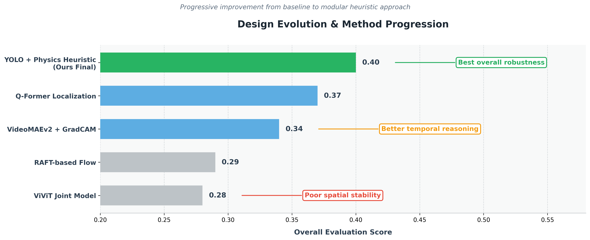

# SynCrash: Multi-Stage Zero-Shot Accident Detection

**Accepted at CVPR 2026 Workshop (Non-Archival)** | Denver, Colorado, June 3–7  
**Authors:** Arkya Bagchi, Ritul Jangir, Varun Raskar  
**Affiliation:** Indian Institute of Technology Jodhpur, India  
**Contact:** [arkyabagchi1112@gmail.com](mailto:arkyabagchi1112@gmail.com) · [LinkedIn](https://www.linkedin.com/in/arkya-bagchi-11018461/)

---

## Architecture

<p align="center">
  
</p>

## Overview

Accident detection in low-resolution CCTV is challenging due to compression artifacts and occlusions. Our key insight is that **temporal dynamics transfer better from synthetic data than spatial features**.

### Contributions
- Modular three-stage pipeline (**Temporal → Spatial → Classification**).
- Domain-bridging VideoMAEv2 training with CCTV-degradation augmentations.
- Physics-informed spatial localization using a 6-strategy heuristic cascade.

---

## Method

### Stage 1 — Temporal Localization
- **VideoMAEv2-Giant** backbone (1408-d features) with metadata embeddings (scene, weather, daytime → 1504-d combined vector).
- Binary classification via `BCEWithLogitsLoss`, trained with AdamW (lr = 2e-5).
- Dense sliding-window inference (stride 2) + Gaussian smoothing (σ = 2) → argmax → predicted accident time.

### Stage 2 — Spatial Localization
- **YOLOv8 + ByteTrack** detection cached as JSON bounding boxes.
- 6-strategy geometric priority cascade:
  1. BBox Overlap Centroid
  2. Trajectory Ray Intersection
  3. Size-Weighted Midpoint
  4. Closest Pair
  5. Single Vehicle Center
  6. Fallback (0.5, 0.5)

### Stage 3 — Collision-Type Classification
- Rule-based kinematic heuristic using velocity vectors from 5-frame polyfit trajectory estimation.
- Classes: `single` · `rear-end` · `t-bone` · `sideswipe` · `head-on`

---

## Results

*Ranks 17th overall on the ACCIDENT@CVPR2026 private leaderboard.*

| Method | Public | Private |
| :--- | :---: | :---: |
| Graph-based interaction model | 0.27 | 0.25 |
| ViViT (joint multi-task) | 0.28 | 0.28 |
| RAFT-based motion modeling | 0.29 | 0.28 |
| VideoMAEv2 + Grad-CAM + rule-based | 0.34 | 0.33 |
| VideoMAEv2 + Q-former (query-based) | 0.37 | 0.36 |
| **VideoMAEv2 + YOLO + heuristic (Ours)** | **0.38** | **0.40** |

<p align="center">
  
</p>

---

## Repository Structure

```
SynCrash-CVPR2026/
├── models/
│   ├── videomae_accident.py      # VideoMAEv2-Giant model definition + metadata embedding
│   └── train.py                  # Training loop (BCEWithLogitsLoss, AdamW, mixed-precision)
├── data/
│   ├── dataset.py                # Dataset class, augmentation pipeline, metadata vocabs
│   ├── preprocess_train.py       # Extract 16-frame clips from training videos
│   └── preprocess_test.py        # Extract 16-frame clips from test videos
├── inference/
│   ├── temporal_inference.py     # Stage 1: Raw video → accident time prediction
│   ├── temporal_inference_fast.py# Stage 1: Fast inference from preprocessed .pt clips
│   └── spatial_inference.py      # Stage 2+3: YOLO + heuristic cascade → impact point + type
├── scripts/
│   ├── train.sh                  # SLURM job script for training
│   ├── inference.sh              # SLURM job script for temporal inference
│   └── inference_fast.sh         # SLURM job script for fast clip-based inference
├── figures/
│   ├── architecture-diagram.jpeg # Pipeline architecture (poster figure)
│   ├── design_evolution.png      # Method progression chart
│   └── qualitative_localization.png # Success vs failure case visualization
├── README.md
└── .gitignore
```

---

## Quick Start

### 1. Preprocessing
```bash
# Extract 16-frame clips from raw videos
python data/preprocess_train.py --video_dir <path> --out_dir <path>
python data/preprocess_test.py  --video_dir <path> --out_dir <path>
```

### 2. Training
```bash
sbatch scripts/train.sh
# or directly:
python models/train.py --clips_csv <path> --clips_dir <path>
```

### 3. Inference
```bash
# Temporal (accident time prediction)
python inference/temporal_inference.py --model_weights <path> --test_csv <path>

# Spatial (impact point + collision type)
python inference/spatial_inference.py --temporal_csv <path> --video_dir <path>
```

---

## References

- Wang et al. *VideoMAEv2: Scaling Video Masked Autoencoders with Dual Masking.* CVPR 2023.
- Redmon et al. *You Only Look Once: Unified, Real-Time Object Detection.* CVPR 2016.
- Zhang et al. *ByteTrack: Multi-Object Tracking by Associating Every Detection Box.* ECCV 2022.
- Arnab et al. *ViViT: A Video Vision Transformer.* ICCV 2021.
- Teed & Deng. *RAFT: Recurrent All-Pairs Field Transforms for Optical Flow.* ECCV 2020.
- Dosovitskiy et al. *CARLA: An Open Urban Driving Simulator.* CoRL 2017.

---

## License

This project is released for academic and research purposes.
