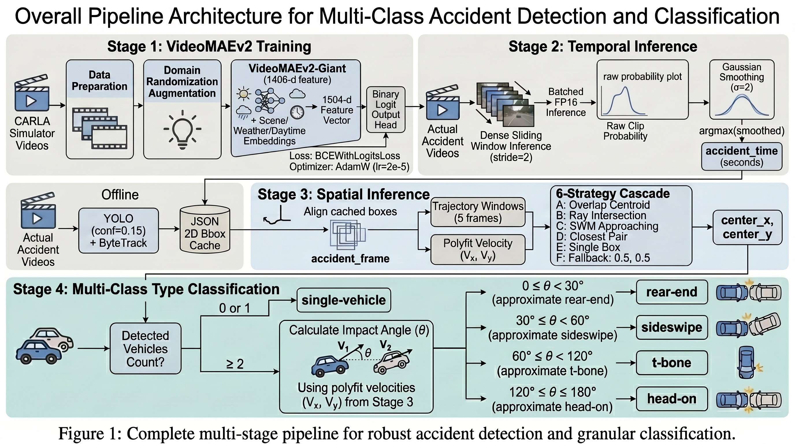
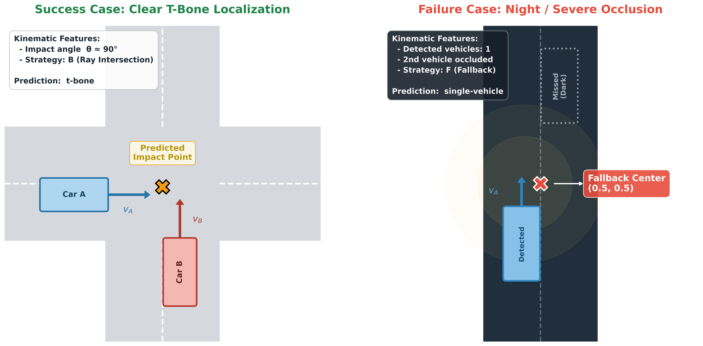

# SynCrash: A Multi-Stage Pipeline for Zero-Shot Accident Detection and Localization in Traffic Surveillance Video

**Accepted at CVPR 2026 Workshop (Non-Archival)** | Denver, Colorado, June 3–7  
**Authors:** Arkya Bagchi, Ritul Jangir, Varun Raskar  
**Affiliation:** Indian Institute of Technology Jodhpur, India  
**Contact:** [arkyabagchi1112@gmail.com](mailto:arkyabagchi1112@gmail.com) · [LinkedIn](https://www.linkedin.com/in/arkya-bagchi-11018461/)

---

## Architecture

<p align="center">
  
</p>

## Abstract

We present SynCrash, a multi-stage pipeline for zero-shot accident detection, spatial localization, and collision-type classification in fixed-view CCTV surveillance video. Designed for the ACCIDENT@CVPR2026 Challenge, the pipeline predicts when an accident occurs, where in the frame the impact happens, and what type of collision it is—all without access to labeled real-world training data. 

The key insight of SynCrash is that **temporal understanding benefits from supervised fine-tuning on synthetic data**, whereas **spatial understanding is better served by pretrained object detectors and physics priors** that transfer naturally across domains.

---

## Method

The pipeline operates in three decoupled stages:

### Stage 1: Temporal Localization
- **Backbone:** VideoMAEv2-Giant fine-tuned on CARLA-based synthetic clips.
- **Features:** Extracts 1408-d spatiotemporal tokens from 16-frame clips, concatenated with 32-d categorical metadata embeddings (scene layout, weather, time-of-day) to form a domain-robust representation.
- **Inference:** Dense sliding-window inference (stride 2) coupled with Gaussian smoothing identifies the peak accident timestamp ($\hat{t}_{acc}$).

### Stage 2: Spatial Localization
- **Detection:** YOLO-based detector extracts vehicle bounding boxes at the frame closest to $\hat{t}_{acc}$.
- **Tracking:** Short-term trajectories are constructed over a fixed window of preceding frames to estimate per-object velocities via linear regression.
- **Geometric Cascade:** A physics-informed hybrid heuristic predicts the impact point based on a strict priority cascade:
  1. Centroid of intersecting bounding boxes (overlap)
  2. Intersection of motion trajectories for approaching objects
  3. Size-weighted midpoint of object centers
  4. Proximity-based midpoint of the closest pair
  5. Center of a single detected object
  6. Fallback to frame center (0.5, 0.5)

### Stage 3: Collision-Type Classification
- **Rule-based Heuristic:** Inferred from the spatial configuration and motion of detected vehicles.
- **Implementation:** Distinguishes `single`-vehicle events. For multi-vehicle interactions, while relative motion cues (anti-parallel, aligned, orthogonal) theoretically map to `head-on`, `rear-end`, and `t-bone`, the practical implementation utilizes a simplified, robust object-count heuristic that maps all multi-vehicle interactions to `t-bone` to maintain stability under noisy detections.

---

## Results

*Ranks 17th overall on the ACCIDENT@CVPR2026 private leaderboard.*

| Method | Public | Private |
| :--- | :---: | :---: |
| Graph-based interaction model | 0.27 | 0.25 |
| ViViT (joint multi-task) | 0.28 | 0.28 |
| RAFT-based motion modeling | 0.29 | 0.28 |
| VideoMAEv2 + Grad-CAM + rule-based | 0.34 | 0.33 |
| VideoMAEv2 + Q-former (query-based) | 0.37 | 0.36 |
| **VideoMAEv2 + YOLO + heuristic (Ours)** | **0.38** | **0.40** |

<p align="center">
  
</p>

The figure above illustrates our spatial localization heuristic in action. On the left (Success Case), clear daytime visibility allows the detection of both vehicles; our pipeline accurately estimates their trajectory intersection to pinpoint a T-Bone collision. On the right (Failure/Fallback Case), low light and occlusion cause the detector to miss the second vehicle; rather than failing catastrophically, our system relies on its robust fallback strategy to predict a single-vehicle event at the frame center, demonstrating resilience under degraded CCTV conditions.

---

## Repository Structure

```
SynCrash-CVPR2026/
├── models/                           # Model architecture & training
│   ├── videomae_accident.py          # VideoMAEv2-Giant + metadata embeddings
│   └── train.py                      # Training loop (BCEWithLogitsLoss, AdamW)
├── data/                             # Data pipeline
│   ├── dataset.py                    # Dataset class + CCTV-degradation augmentations
│   ├── preprocess_train.py           # Extract 16-frame clips from CARLA videos
│   └── preprocess_test.py            # Extract 16-frame clips from test videos
├── inference/                        # Decoupled Inference Stages
│   ├── temporal_inference.py         # Stage 1: Raw video → accident time
│   ├── temporal_inference_fast.py    # Stage 1: Fast inference from preprocessed .pt clips
│   └── spatial_inference.py          # Stage 2+3: External YOLO JSONs + heuristic → impact/type
├── scripts/                          # SLURM job execution scripts
│   ├── train.sh
│   ├── inference.sh
│   └── inference_fast.sh
├── figures/                          # Workshop Poster Visual Assets
│   ├── architecture-diagram.jpeg
│   ├── design_evolution.png
│   └── qualitative_localization.png
└── README.md
```
*(Note: YOLO and ByteTrack bounding box extractions are run as an external preprocessing step. The `spatial_inference.py` script consumes these pre-computed JSON files.)*

---

## Quick Start

### 1. Preprocessing
```bash
# Extract 16-frame clips from raw videos
python data/preprocess_train.py --video_dir <path> --out_dir <path>
python data/preprocess_test.py  --video_dir <path> --out_dir <path>
```

### 2. Training (Temporal Stage)
```bash
sbatch scripts/train.sh
# or directly:
python models/train.py --clips_csv <path> --clips_dir <path>
```

### 3. Inference
```bash
# Temporal (Stage 1: Accident time prediction)
python inference/temporal_inference.py --model_weights <path> --test_csv <path>

# Spatial & Classification (Stages 2 & 3: Impact point + collision type)
python inference/spatial_inference.py
```

---

## References

- Wang et al. *VideoMAEv2: Scaling Video Masked Autoencoders with Dual Masking.* CVPR 2023.
- Redmon et al. *You Only Look Once: Unified, Real-Time Object Detection.* CVPR 2016.
- Zhang et al. *ByteTrack: Multi-Object Tracking by Associating Every Detection Box.* ECCV 2022.
- Dosovitskiy et al. *CARLA: An Open Urban Driving Simulator.* CoRL 2017.

---

## License

This project is released for academic and research purposes.
